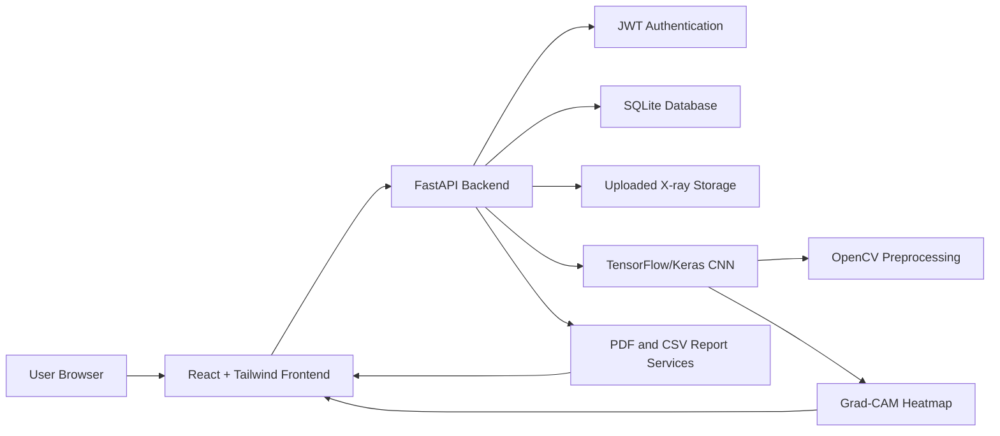

# Architecture

## Request Flow

1. User authenticates and receives a JWT.
2. User uploads a JPG, JPEG, or PNG chest X-ray from the protected dashboard.
3. FastAPI stores the image, preprocesses it with OpenCV, and sends it to the TensorFlow model.
4. The model returns a normal or pneumonia prediction and confidence score.
5. Grad-CAM creates a heatmap overlay from the final convolutional layer.
6. The scan row is stored in SQLite.
7. React displays result cards, original image, heatmap, analytics, history, and report links.
